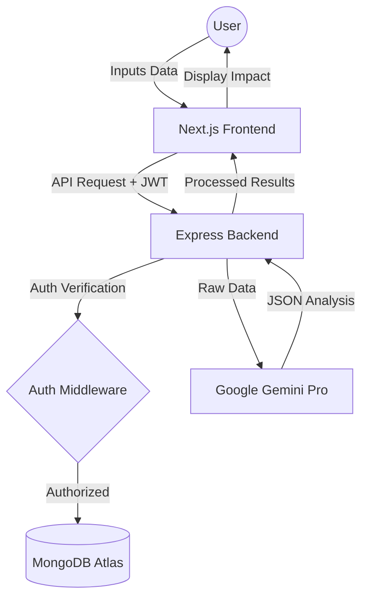

# 📘 EcoAnalyzer: Full System Architecture & Project Workflow (A-Z)

This document provides a comprehensive technical walkthrough of how the **EcoAnalyzer** platform operates, from the user's first click to the AI's final analysis.

---

## 1. High-Level Architecture
EcoAnalyzer is built as a **Decoupled Full-Stack Application**:

- **Frontend (The Interface)**: Built with Next.js 15, hosted on Vercel. It handles the UI, state management (AuthContext), and client-side animations.
- **Backend (The Core)**: A Node.js/Express server running as Vercel Serverless Functions. It acts as the gatekeeper for data and the bridge to the AI.
- **Database (The Memory)**: MongoDB Atlas (NoSQL) stores user profiles, analysis history, community articles, and leaderboard data.
- **AI Brain (The Engine)**: Google Gemini Pro API performs the complex environmental reasoning.

---

## 2. A-Z User Workflow

### A. Authentication & Onboarding
1. **Signup/Login**: Users authenticate using Email/Password.
2. **JWT Security**: Upon login, the server issues a **JSON Web Token (JWT)** stored in the browser as a secure cookie.
3. **Session Persistence**: The `AuthContext` ensures the user remains logged in across refreshes.

### B. The AI Impact Analysis Flow
1. **Input**: A user enters product details or a lifecycle description into the **Analyze** page.
2. **API Request**: The frontend sends the query + JWT to `POST /api/analyze`.
3. **AI Reasoning**: The backend prompts **Google Gemini Pro** with a specialized system instruction to evaluate:
    - Manufacturing energy intensity.
    - Material sustainability.
    - Transportation logistics.
    - End-of-life disposal.
4. **Scoring**: The AI returns a structured carbon footprint score (0-100) and actionable eco-tips.
5. **Persistence**: The result is saved to the `History` collection in MongoDB for user tracking.

### C. Community Knowledge Base (Articles)
1. **Submission**: A user writes an article in the **Learning** hub.
2. **Moderation Queue**: The article is saved with `status: 'pending'`.
3. **Admin Review**: Admins access the **Admin Dashboard** to:
    - Approve/Reject new submissions.
    - Review **Update Requests** (side-long comparison of old vs. new content).
    - Approve **Deletion Requests**.
4. **Publication**: Approved content becomes visible to the entire global community.

### D. Gamification & Learning
1. **Eco Quiz**: Users take a 10-question quiz fetched from the backend.
2. **Scoring Logic**: Correct answers grant `points`.
3. **Leveling Up**: Reaching point thresholds increases the user's `level` and awards `badges`.
4. **Leaderboard**: A real-time aggregate of top-performing "Eco-Warriors" based on MongoDB sorting.

---

## 3. Data Flow Diagram

---

## 4. Administrative Controls
The platform includes high-level oversight features:
- **Global Management**: Admins can search and delete *any* article to maintain platform safety.
- **Role-Based Access**: Specialized middleware (`adminMiddleware.js`) ensures only authorized accounts can access the Review Queue or User Management.

---

## 5. Deployment & Scalability
- **Frontend**: Next.js optimized for Vercel's Edge Network for fast global loading.
- **Backend API**: Optimized as Serverless Functions to handle variable traffic without cost when idle.
- **Environmental Impact**: By using serverless architecture, we reduce our own carbon footprint by only consuming compute resources when necessary.

---

## 6. Future-Proofing
- **API Extensibility**: The modular controller structure allows for easy integration of future AI models or multi-chain blockchain verification.
- **Responsive Design**: Designed for everything from 4K monitors to mobile devices using Tailwind's mobile-first CSS.

---
*EcoAnalyzer: Engineering a Transparent and Sustainable Future.* 🌿
